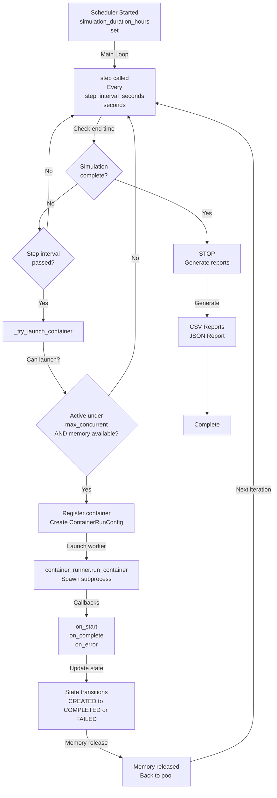
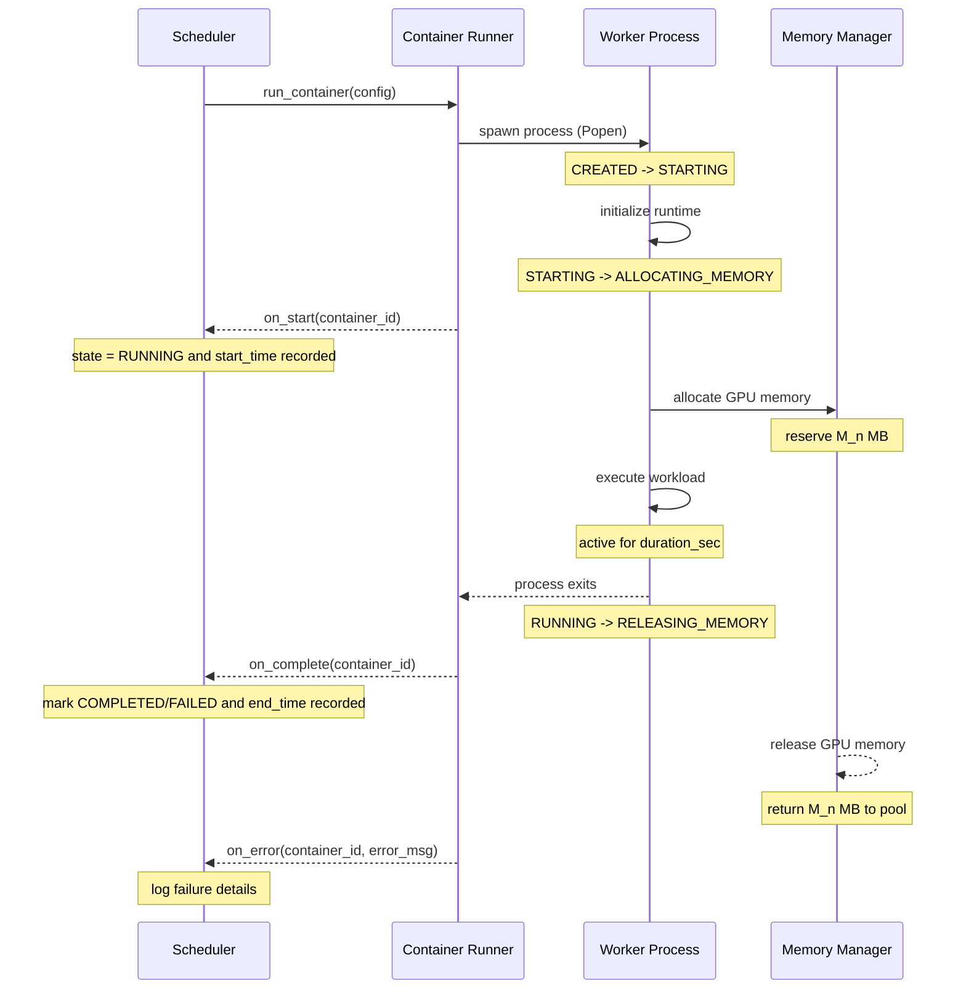

# GPU Container Orchestration System

A scheduler that manages GPU containers efficiently. It runs multiple containers on a GPU while carefully controlling memory usage and preventing crashes.

## What This Does

This system schedules and runs containers that need GPU memory. It ensures:
- Containers get the GPU memory they need without exceeding limits
- Memory is properly allocated and cleaned up
- Containers that hang or crash are detected and handled
- The scheduler never blocks and stays responsive

Think of it like a traffic controller for GPU resources - it manages which containers run, how much memory each gets, and handles problems like out-of-memory errors or stuck processes.

## Quick Start

### 1. Install Dependencies
```bash
pip install -r requirements.txt
```

### 2. Run the Scheduler
```bash
python scheduler/main.py
```

The scheduler starts and begins accepting containers. By default, it:
- Uses 4GB of GPU memory
- Allows 3 containers to run at the same time
- Runs for 24 hours (see config.ini to change)


Tests verify that memory management, container handling, and error recovery work correctly.

### 3. Run with Docker

```bash
docker build -t gpu-scheduler:latest .
```

### Run (One Command)
```bash
docker-compose up -d
```

### Monitor (One Command)
```bash
docker-compose logs -f scheduler
```

### Stop (One Command)
```bash
docker-compose down
```

This runs the entire system in containers, including the scheduler, worker processes, and monitoring.

## How It Works

### The Main Flow

1. **Scheduler** sits in the main thread and accepts new container requests
2. **Memory Manager** tracks which GPU memory is in use and which is available
3. **Worker** process runs each container and manages its lifecycle
4. **Watchdog** monitors for stuck processes or out-of-memory errors
5. **State Tracker** records what each container is doing at each moment

### Container Lifecycle

Each container goes through these states:
- **CREATED**: Registered with the scheduler
- **STARTING**: Process is starting
- **ALLOCATING_MEMORY**: GPU memory is being reserved for it
- **RUNNING**: Container is running with memory allocated
- **RELEASING_MEMORY**: Memory is being freed up
- **COMPLETED**: Container finished successfully
- **FAILED**: Container crashed or ran out of memory

If a container fails during memory allocation, the scheduler reclaims that memory slot so other containers can use it.

## Complete Rebuild 

```bash
# 1. Stop everything
docker-compose down -v

# 2. Clean Docker completely
docker system prune -a -f

# 3. Remove image
docker rmi gpu-scheduler:latest

# 4. Pull latest code
git pull origin main

# 5. Rebuild with the new cache-busting Dockerfile
docker build --no-cache -t gpu-scheduler:latest .

# 6. Start
docker-compose up -d

## Configuration

Edit `config.ini` to adjust:

- `total_gpu_memory_mb`: How much GPU memory to use (default: 4096 MB)
- `container_duration_seconds`: How long containers run (default: 600 seconds = 10 minutes)
- `max_concurrent_containers`: How many containers can run at the same time (default: 3)
- `memory_multiplier`: How much memory grows with each new container (default: 1.5)
- `step_interval_seconds`: How often the scheduler checks for work (default: 5 seconds)
- `watchdog_poll_interval_seconds`: How often to check if processes are stuck (default: 10 seconds)

Example: To test quickly with smaller memory:
```ini
total_gpu_memory_mb = 2048
container_duration_seconds = 10
max_concurrent_containers = 2
```

## Project Structure

```
gpu-scheduler/
├── scheduler/              # Core scheduling logic
│   ├── main.py            # Entry point - runs the scheduler
│   ├── memory_manager.py  # Allocates and tracks GPU memory
│   ├── state_tracker.py   # Records container states and transitions
│   ├── container_runner.py # Launches containers
│   ├── watchdog.py        # Monitors for stuck processes
│   ├── memory_watchdog.py # Monitors memory usage
│   └── csv_reporter.py    # Generates reports
├── worker/
│   └── worker.py          # Child process that runs containers
├── simulation/
│   └── simulator.py       # Simulates containers for testing
├── config.ini             # Configuration file
├── config_loader.py       # Loads and validates config
└── docker-compose.yml     # Docker setup
```

## Key Components Explained

### Memory Manager
Tracks GPU memory like a bank tracks money. Each container gets a "block" of memory. When memory is released, the block is returned to the pool and another container can use it.

### State Tracker
Keeps a record of every container's journey through the lifecycle. This is useful for debugging and understanding what happened during a run.

### Watchdog
Monitors processes to catch problems:
- If a process is stuck (not making progress), it kills it
- If a container uses too much memory (OOM), it handles the failure gracefully
- Detects "zombie" processes that don't respond

### Container Runner
The actual launcher. It starts worker processes and tracks their output.

### CSV Reporter
At the end of a run, generates reports showing:
- How much memory each container used
- How long containers took to complete
- State transitions (when containers moved between states)
- Any failures and why they happened

## Running the System

### Normal Run
```bash
python scheduler/main.py
```

This runs the scheduler. It will:
- Start accepting containers
- Print progress to the console
- Generate a report when done (reports/ directory)

### Quick Test (5 minutes)
Modify config.ini:
```ini
container_duration_seconds = 10
step_interval_seconds = 5
max_concurrent_containers = 2
total_gpu_memory_mb = 4096
```

Then run:
```bash
python scheduler/main.py
```


## Understanding the Logs

The scheduler prints messages like:
```
INFO - Scheduler started
INFO - Allocated memory for container 1: 1293 MB
INFO - Container 1 transitioned to RUNNING
INFO - Container 1 transitioned to RELEASING_MEMORY
INFO - Memory freed from container 1: 1293 MB
INFO - Scheduler shutdown complete
```

Look for:
- Memory allocations and releases to understand resource usage
- State transitions to track where containers are in their lifecycle
- Any ERROR or CRITICAL messages indicating problems
- Final summary showing total containers completed

## Reports

After the scheduler finishes, check the `reports/` directory for CSV files showing:
- Container metrics (memory used, duration, success/failure)
- Memory timeline (how much memory was used over time)
- State transitions (complete history of container state changes)

## Common Issues

**Containers failing immediately**: Check `config.ini` - memory settings may be wrong. Try increasing `total_gpu_memory_mb`.

**Scheduler seems stuck**: Check watchdog settings. The `watchdog_poll_interval_seconds` might be too high, causing slow detection of stuck processes.

**Out of memory errors**: Reduce `memory_multiplier` or lower `total_gpu_memory_mb` in config.ini.

**Docker containers not starting**: Run `docker-compose logs scheduler` to see what went wrong.

## Testing Different Scenarios

The codebase includes a simulator that can test without real GPU resources:
```bash
python simulation/simulator.py
```

This simulates containers to verify the scheduler logic works correctly.

## Scheduler state machine diagram


## Container Execution Sequence



## Development Notes

- The scheduler runs in a single thread and is non-blocking
- All state changes are logged and tracked
- Memory management uses numpy arrays or GPU tensors (if available)
- The system is designed to be fault-tolerant: failures are caught and handled
- Use Docker for isolated testing without affecting your system


